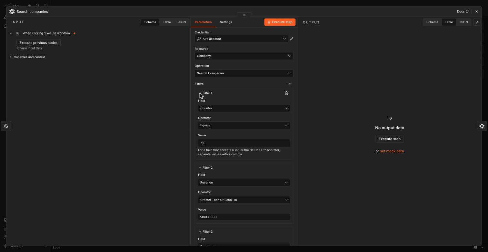

# @aira-apps/n8n-nodes-aira

Read the companies your organization tracks in [Aira](https://ai.aira.app), from an n8n
workflow. This README travels verbatim to the package root when a release is published — it is
the npm page, the GitHub front page, and the first thing a Community Node Portal reviewer opens.

## Install

In n8n: **Settings → Community Nodes → Install**, and enter `@aira-apps/n8n-nodes-aira`.

Then create an **Aira API** credential: paste in an Aira Connect API key and press **Test** — it
hits `GET /v1/me`, which is free to call as often as you like.

**This key is unscoped: it can do anything the Aira Connect API can, not only what this node
uses.** Treat it like a password. Only an organization owner or admin can create one, in Connect
settings.

## What's here

One **Company** resource, four operations (alphabetical, default **Get Company**): **Get
Company**, **Get Portfolio Companies**, **Get Saved View Companies**, **Search Companies**.

### Get Company

Takes a company by **URL**, **organization number**, or **Aira id**. An identifier that matches
nothing returns no items — not an error, not a blank row. A bad key, a rate limit, or a server
error still throws.

### Get Portfolio Companies

Returns every company your organization holds — no filters. Chain a downstream **Filter** node
if you need to narrow the results.

### Get Saved View Companies

Picks a saved view **From List** or **By ID** (`sav_...`, rejected in the panel if mistyped) — no
By URL, which would freeze a UI route into the node's contract.

### Search Companies

Builds a filter from flat predicate rows — **Field**, **Operator** (narrowed to what the field
supports, no network call), **Value**. Rows always fold to a single AND; reach OR or NOT through
**Options → AQL Query**, which replaces the rows entirely when set.



Below is a Search Companies configuration and the predicate rows it produces — useful as a
starting point to paste into a **Filters** collection (each row under **Add Filter**):

```json
{
	"predicates": {
		"row": [
			{ "field": "country", "operator": "eq", "value": "SE" },
			{ "field": "revenue", "operator": "gte", "value": "50000000" },
			{ "field": "employees", "operator": "gte", "value": "250" }
		]
	},
	"limit": 50
}
```

That configuration searches for Swedish companies with revenue of at least 50,000,000 and at
least 250 employees. To express `revenue >= 50000000 OR employees >= 250` instead — which flat
rows cannot, since they always fold to AND — use **Options → AQL Query**:

```
country = "SE" AND (revenue >= 50000000 OR employees >= 250)
```

> The screen recording of the Search panel (predicate rows, the Field/Operator/Value controls,
> and the AQL Query fallback in the running n8n editor) that this ticket's acceptance criteria
> require is a Creator Portal submission artifact, not something this repo carries. See
> `MAINTAINING.md`'s "Outstanding" section.

## Sample workflows

Two ready-to-import workflows ship in [`samples/`](./samples): **Get Company** and **Get Saved
View Companies**. In n8n: **Import from File** (or paste the JSON via **Import from URL**/clipboard),
then fill in your own **Aira API** credential and, for Get Saved View Companies, pick a saved
view. Search isn't included as a sample — a click-to-run global search bills company rows on
every import and first click, so it's demonstrated above instead.

## Caveats and limits

- **Every list operation** (Get Portfolio Companies, Get Saved View Companies, Search Companies)
  takes a **Limit** (default 50, max 1000, no Return All), fetched internally in chunks of at
  most 99. Past 1,000 rows, page with **Cursor** in and **Options → Output Pagination Cursor**
  out.
- **A search may contain at most 32 predicates across at most 8 branches of an OR, one country
  per search**, and **Starts With / Contains on Name needs at least 3 characters**. A breach is
  rejected by the API with a 400, not by the panel.
- **Hitting your organization's daily row ceiling or its per-minute rate limit fails the whole
  request loudly — never a partial page.** Neither error states a number; ask your organization
  admin if you are unsure of your current limits.
- **The Aira API credential's key is unscoped.** It can read everything your organization's
  Connect access covers, not only what this node calls. Only an organization owner or admin can
  create one.
- Data comes from the licences covering Aira's company data — not every field is populated for
  every company or market, and a missing field means no value is on file, not that the value is
  zero.

## Development

```bash
pnpm --filter n8n check-types
pnpm --filter n8n lint
pnpm --filter n8n test
pnpm --filter n8n build   # tsc + copies icons into dist — see MAINTAINING.md
```

See `MAINTAINING.md` for the TypeScript alias this package needs, the source layout, the test
seams, and the release pipeline that publishes this package.

## Learn more

- [Aira Connect API docs](https://developers.aira.app)
